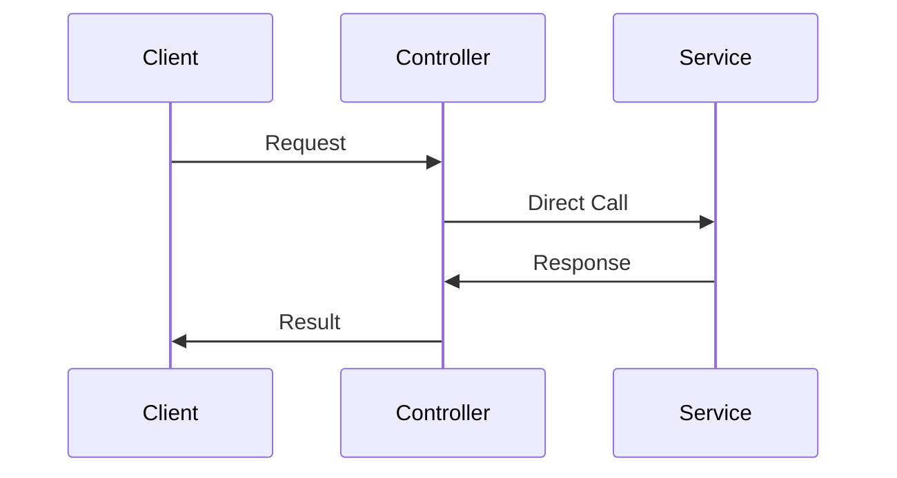
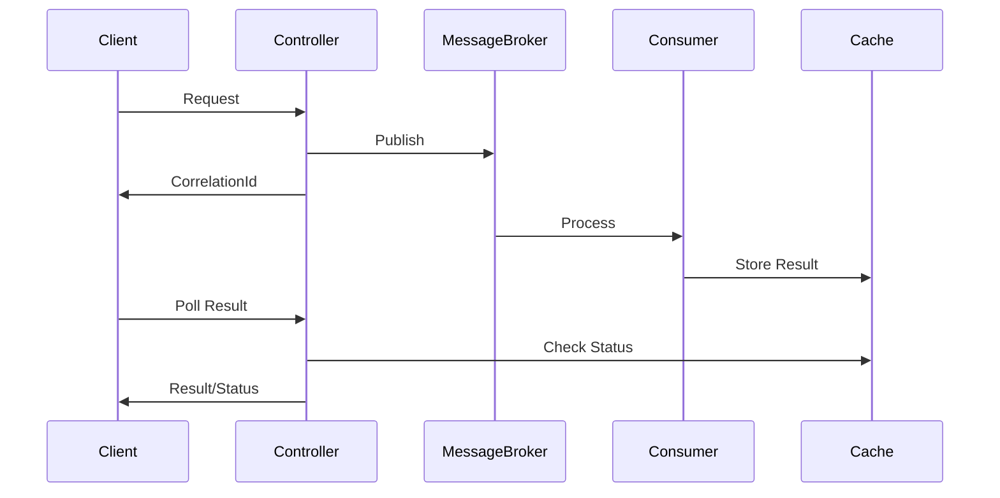

# GutenSight Server Architecture Flow

## System Components

### 1. Caching System
- **LFU Cache** (`cache/inMemoryDB.ts`)
  - General purpose caching
  - Least Frequently Used eviction policy
  - Size-limited cache storage

- **Streaming Cache** (`cache/cacheDB.ts`)
  - Specific for async operation responses
  - Correlation ID based storage
  - Status tracking for operations

### 2. In-House Message Broker
- **Message Store** (`streaming/messaging/messageStore.ts`)
  - Topic-based message storage
  - Message persistence
  - Message cleanup

- **Message Broker** (`streaming/messaging/messageBroker.ts`)
  - Pub/sub pattern implementation
  - Topic management
  - Message delivery

### 3. Controllers
- **Streaming Controller** (`controllers/v1/streaming.controller.ts`)
  - Handles async operation polling
  - Status checking
  - Response retrieval

- **Regular Controllers** (auth, user, post)
  - API endpoint handlers
  - Request validation
  - Response formatting

## Message Flow

```mermaid
graph TD
    A[Client Request] --> B[Controller]
    B --> C{Async Operation?}
    C -->|Yes| D[Message Broker]
    C -->|No| E[Direct Service Call]
    D --> F[Message Store]
    F --> G[Consumer Processing]
    G --> H[Cache Response]
    H --> I[Client Polls Result]
    E --> J[Return Response]

    
Operation Types
1. Synchronous Operations
    Client → Controller → Service → Response

2. Asynchronous Operations
    1. Request Initiation:
    Client → Controller → Message Broker
    ↳ Returns correlationId

    2. Background Processing:
    Message Broker → Consumer → Service
    ↳ Stores result in cache

    3. Result Retrieval:
    Client → /streaming/{correlationId} → Cache
    ↳ Returns result/status


Key Features
1. Message Handling
Topic-based routing
Message persistence
Consumer offset tracking
Message deduplication
2. Response Caching
Correlation ID tracking
Status updates
Result storage
Cache eviction
3. Error Handling
Operation status tracking
Error response formatting
Service error logging


API Response Patterns
1. Sync Operations
{
  "success": true,
  "message": "Operation completed",
  "data": { ... }
}

2. Async Operations
Initial Response:
{
  "success": true,
  "message": "Request received",
  "correlationId": "operation-123"
}

Status Check Response:
{
  "success": true,
  "status": "completed|pending",
  "data": { ... }
}

Implementation Notes
Message Broker:
In-memory implementation
No persistence across restarts
Simple pub/sub pattern

Caching:
Two separate cache systems
Size-limited storage
Automatic cleanup

Error Handling:
Centralized error handling
Status code standardization
Error logging

Usage Examples
Publishing a Message
await messageBroker.publish(KAFKA_TOPICS.UPDATE_USER, {
  serviceName: 'updateUser',
  correlationId: 'update-123',
  payload: data
});

Subscribing to Messages
messageBroker.subscribe(topic, async (message) => {
  const result = await processMessage(message);
  await addStreamingRecord(message.correlationId, result);
});

Checking Operation Status
GET /api/v1/streaming/:correlationId

Security Considerations
Correlation IDs:
Unique per operation
Time-based generation
Random component

Cache Security:
Size limits
Automatic eviction
No sensitive data storage


# GutenSight Server Architecture

## Overview

GutenSight implements an in-house messaging system replacing Kafka, with persistent caching and asynchronous processing.

## Core Components

### 1. Message Broker System
Located in `app/streaming/messaging/`:

```typescript
class MessageBroker {
    private store: MessageStore;
    private subscribers: Map<string, Set<MessageHandler>>;
    // ...existing code...
}
```

### 2. Dual Caching System

#### General Purpose Cache (LFU)
```typescript
class LFUCache {
    records: Map<any, any>;
    maxSize: number;
    // ...existing code...
}
```

#### Streaming Response Cache
```typescript
export const addStreamingRecord = async (id: string, data: any) => {
    // ...existing code...
};
```

## Message Flow

1. **Client Request Initiation**
```typescript
// Controller Example (user.controller.ts)
const updateUserHandler = asyncHandler(async (req: Request, res: Response) => {
    const correlationId = `update-user-${Date.now()}`;
    await KafkaProducer(KAFKA_TOPICS.UPDATE_USER, {
        serviceName: 'updateUser',
        correlationId,
        payload: { /* ... */ }
    });
    // ...existing code...
});
```

2. **Message Processing**
```typescript
// Consumer (consumer.ts)
messageBroker.subscribe(topic, async (message) => {
    const response = await v1Services[serviceName](data.payload);
    await addStreamingRecord(key, {
        response,
        status: 'completed',
        timestamp: Date.now()
    });
});
```

3. **Response Retrieval**
```typescript
// Streaming Controller
const getResponse = asyncHandler(async (req: Request, res: Response) => {
    const result = await getStreamingRecord(correlationId);
    // ...existing code...
});
```

## Sequence Diagrams

### Synchronous Operation


### Asynchronous Operation


## Implementation Details

### 1. Message Structure
```typescript
interface QueueMessage {
    id: string;
    topic: string;
    data: any;
    timestamp: number;
}
```

### 2. Response Status Types
```typescript
type ResponseStatus = 'pending' | 'completed' | 'failed';
```

### 3. Cache Records
```typescript
interface CacheRecord {
    messageId: string;
    status: ResponseStatus;
    timestamp: number;
    response?: any;
}
```

## API Response Formats

### 1. Initial Async Request
```json
{
    "success": true,
    "message": "Request received",
    "correlationId": "update-user-1234567890"
}
```

### 2. Status Check Response
```json
{
    "success": true,
    "status": "completed",
    "data": { /* result data */ }
}
```

## Configuration

### 1. Cache Settings
```typescript
export const EXPIRATION_DAYS = 7 * 24 * 60 * 60 * 1000; // 7 days
export const LFU_CACHE_LIMIT = 10000;
```

### 2. Message Topics
```typescript
export const KAFKA_TOPICS = Object.freeze({
    UPDATE_USER: "UpdateUserTopic",
    // ...other topics
});
```

## Best Practices

1. **Error Handling**
   - Always use try-catch blocks
   - Log errors with appropriate levels
   - Return standardized error responses

2. **Cache Management**
   - Implement size limits
   - Use proper eviction policies
   - Handle cache misses gracefully

3. **Message Processing**
   - Validate message structure
   - Handle service unavailability
   - Implement retry mechanisms

## Security Considerations

1. **Message Validation**
   - Verify service names
   - Validate payload structure
   - Check authorization

2. **Cache Security**
   - No sensitive data storage
   - Implement TTL
   - Regular cleanup

3. **API Security**
   - Rate limiting
   - Request validation
   - Authorization checks
Message Security:
Input validation
Service name verification
Error isolation